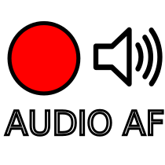

# Audio AF

__This project Is hosted on Gitlab and Mirrored to Github, please interact with this repo through Gitlab.__

## About
Audio Abstractions Framework - Many audio projects could benefit from something similar to LibGDX but for audio manipulation. This is that library
